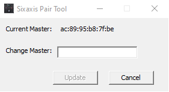

# PS4 Controller

## ESP32 Support for Arduino IDE
* ESP for arduino: https://randomnerdtutorials.com/installing-the-esp32-board-in-arduino-ide-windows-instructions/
* Use a ESP32 module for bluetooth conneciton:
* For that, you may need to manually install driver 
  * The CH340 is the driver in question
  * https://chewett.co.uk/blog/1049/wemos-d1-mini-not-recognised-windows-no-com-port/
  * https://www.wemos.cc/en/latest/tutorials/d1/get_started_with_arduino_d1.html
* Choose Esp32vn IoT Uno as Board for AZ Delivery D1 R32 Esp32 board

## Connect PS4 Controller
* use your ps4 do get to know the controllers master mac address (the ps4 address)
* or use a tool like [sixaxispairer](https://github.com/user-none/sixaxispairer) to get to know it or even change the mac address to your needs. 
  If it worked correctly it should show you the current master mac address. You can either use it or replace it. Beweare, I read that the tool should not be used with newer PS4 controller versions..
* Download and apply: https://github.com/aed3/PS4-esp32
* Check if https://github.com/aed3/PS4-esp32/issues/27 is still open. If so, apply the provided patch instructions.
* If you installed the ESP32 module as described in [Section 1](#esp32-support-for-arduino-ide) there should be no need manually install ESP-IDF. Yet, for completeness please refer to [ESP-IDF](https://docs.espressif.com/projects/esp-idf/en/stable/esp32/get-started/index.html) if you want to install it on your own.

Once everything is ready and the masters mac address stored in the controller is known, please enter the address in [ps4_controller.ino](ps4_controller.ino). 
If you now flash your board with the implementation and then push the home button of the controller you should see a "connected" message on Serial monitor.

## Power-Consumption:
* ESP32 Board (BT + SPI)
  * At 8V
  * Operating Current as of datasheet (https://cdn.shopify.com/s/files/1/1509/1638/files/D1_R32_Board_Datenblatt_AZ-Delivery_Vertriebs_GmbH.pdf?v=1606741744): 250 mA 
  * Bluetooth Disconnected (20 mA) / Bluetooth Connected (55 mA)

